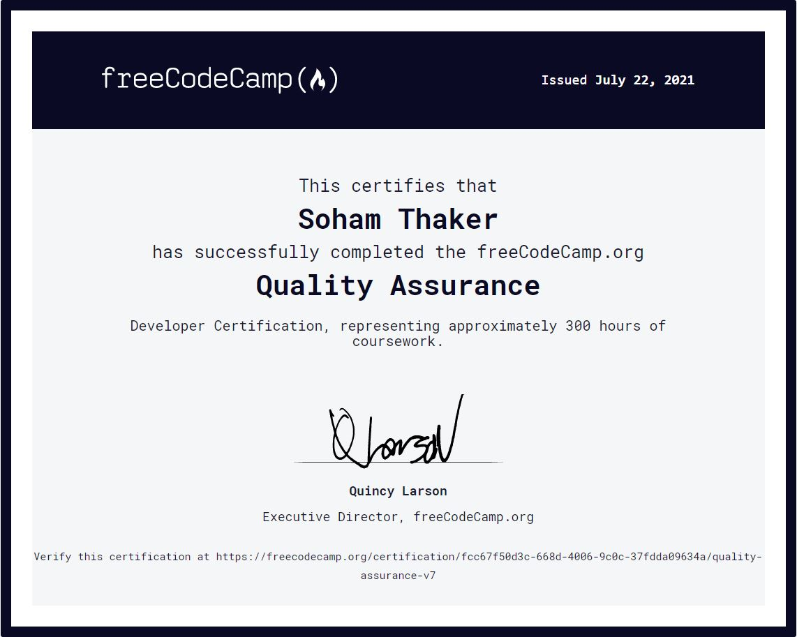

# Quality Assurance Projects
freeCodeCamp Quality Assurance certification projects: [Quality Assurance Projects](https://www.freecodecamp.org/learn/quality-assurance/#quality-assurance-projects)

## Technologies used:
     

## Certification:

